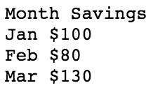

# csv2html

convert csv file to html table

### Installation

    go get -u github.com/brg-liuwei/csv2html

### Usage

    csv2html -h

### eg:

    csv2html -csv test.data > test.html

test.data:

test.html:

